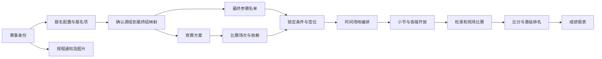

# 用户意图、状态依赖与执行

## 从要求定位动作

先识别“作用对象 → 期望变化 → 范围 → 验收结果”。用户已给出的参数和授权直接沿用；仅询问会改变结果的歧义。目录检索是候选定位，不是自动授权或自然语言执行器。

|用户说法|必须分清的动作与对象|
|---|---|
|报名人数不够、并组|报名项目调组、竞赛方案调整、最终名单映射是不同操作。确认源组→目标组、资格和让分、取消项与退款处置；补充通知由离线 skill 起草|
|名单改一下|人员姓名纠错可能跨项目同步；替换参赛者要保留旧记录并核对兼项、搭档、种子和签位；改队名与改队员也不同|
|抽签不对、重新抽签|调整种子、候选方案、采用候选、手动调签、导入签位、清空重抽分别定位；开赛后强制导签不默认启用|
|赛程往前调、换场地|既有场次的时间/场地编排，不是重生成比赛。原 CCH、胜负依赖、比分保留；重新验证兼项休息与固定安排|
|重新生成赛程|可能改变对阵、场次编号、签表和编排；先读现状及覆盖范围。不能仅因导入失败就清空重建|
|发布秩序册、小节|系统报表可见性、自制文件上传、小节分配、各端开放是不同操作；需按用户指明的受众定位|
|给选手通知|正文发布不等于发送通知。确定渠道、对象和时间；“测试通知”也会真实发送|
|选手弃权、成绩错了|区分报名退赛、单场弃权、后续全部弃权、比分更正和清空比分；不能统一写成21:0|
|创建比赛、开赛|创建基础资料不隐含扣费锁名单、退款、支付、通知或覆盖已有成绩；“开赛”须明确开放哪些终端/小节|

## 读取状态再决定下一步

状态不是“已点过按钮”的流程编号。对目标项目、阶段、小节分别读取当前完整事实：报名来源、已付款/未付款、方案、有效名单及锁定、场次、签位、编排、小节、可见性、已开赛和成绩。分页/筛选未解除时不能把当前页当全量。未知不等于未完成；先补读，不重复创建。

依赖关系（分支允许独立进行，不强制一条流水线）：

图示是对象依赖；平台抽签实际前置条件以当前页为准。本地算法可独立生成文件；把结果上传跑兔仍需当前真实 ID 和已核验入口。已经存在且合格的节点直接复用。

|变更|需要重新检查的下游，不代表自动删除|
|---|---|
|报名调组/取消|付款与退款事实、最终映射、重复参赛、人数、规程补充通知|
|方案人数、阶段、赛制|场次结构、CCH 映射、签位、编排、小节、报表|
|名单、搭档、种子|资格、回避、兼项、签位、对阵、排期；已开赛比赛单独处理|
|场次重建|所有引用旧 CCH 的导入表、签位、时间场地、比分及发布物|
|编排前移/换场|人员冲突、前后依赖、休息、小节边界、终端展示与节目单|
|比分/弃权更正|胜负者去向、下游选手、是否已开赛、循环排名、最终名次、证书和成绩公示|
|正文或可见性|相应项目及客户端展示；不自动发送消息、不修改报名资格|

目录的 `requires` 是预检用的事实名称，`impacts` 是需复核的对象。它们不是后端必填字段，也不是可以自动串行调用的接口。

## 提交与回读

1. 核对目标赛事、运动模块、当前路由、组件方法、权限及完整前置状态。组件重名时以路由区分。静态代码存在不代表账户有权限或服务端已实现。
2. 获取提交前快照及精确差异。涉及收费/清空/已开赛结果等超出当前请求的变化，准备好影响说明后再问缺少的授权；已有授权不重复问。
3. 从当前页面形成真实参数，区分同一接口的查询/添加/修改/删除模式。不依据 `get`、`init`、POST 或按钮“检查”字样判断副作用；共享请求对象须串行使用。
4. 提交一次后全量回读。超时或返回不明先查落库状态；未查明不重试。已定位的可恢复差项可在原授权内修复；同一错误无新证据停止重复提交。
5. 回执列明目标、操作、前后差异、直接回读和下游复核、失败/未验证项。角色不足、入口空壳或合同未核验时保留本地成果，报告具体缺口。

“静态观察”“当前会话只读回读”“实际写入回读”分别记录。不得把本地预检、演示向导或只读浏览当作真实操作成功。

字段合同、可运行的任务范围检查、三份快照恢复判定和临场变更验收见[恢复与流程测试](recovery-and-testing.md)。快照比较只能证明所提供的字段一致；必须保留完整读取的来源证据，另行核对未建模副作用。
